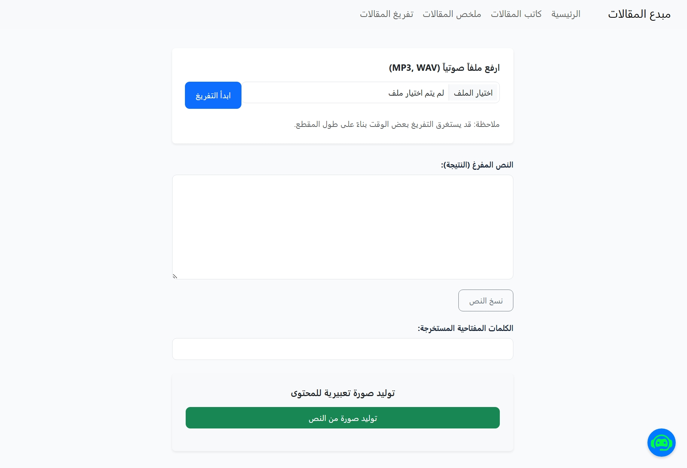
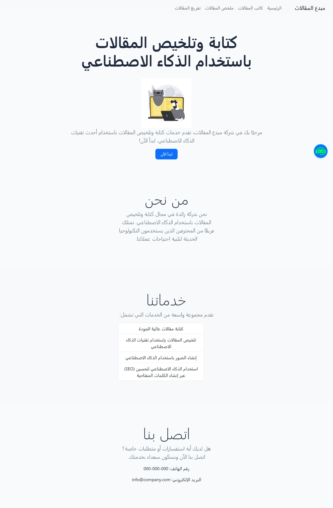
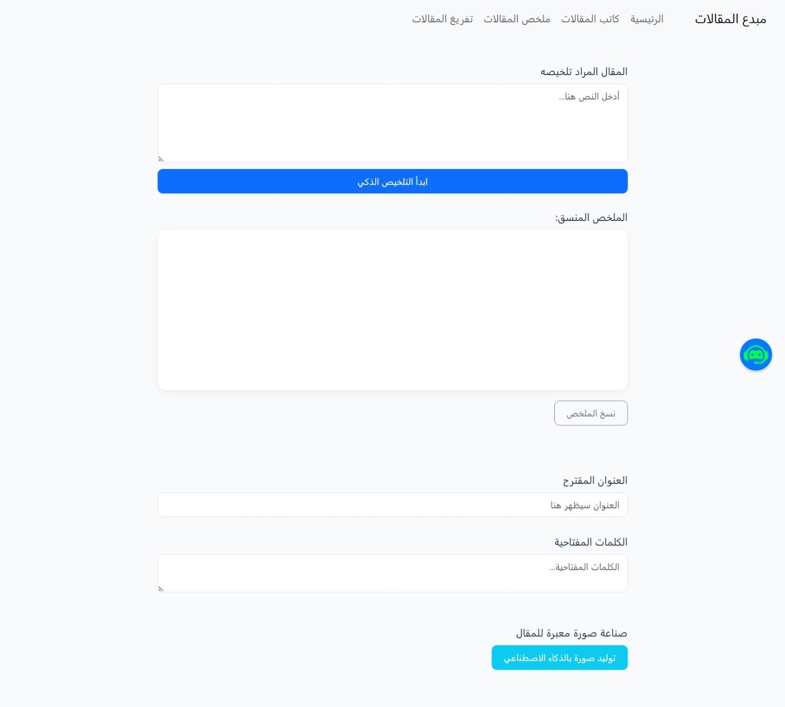

# 🚀 AI Content Studio | Full-Stack Content Generation Platform


An integrated, locally-hosted platform designed for content creators to generate articles, summarize texts, transcribe audio, and create images using cutting-edge AI models. The project fully supports Arabic and English with a modern, user-friendly interface.

---

## 📸 Project Screenshots

### 1. Smart Summarization (with Live Streaming)


### 2. Audio Transcription (Whisper AI)


### 3. 🤖 Intelligent RAG Chatbot
> *Interactive AI assistant that retrieves answers directly from your local text documents using Retrieval-Augmented Generation (RAG).*


### 4. 🏠 Main Dashboard
> *The central hub for all AI tools with a clean and focused design.*


### ⚡ 5. Smart Article Summarization
> *Watch the AI summarize long articles word-by-word with beautiful Markdown formatting.*


---

## ✨ Key Features

* **📝 Article Generation & Expansion:** Generate professional articles and expand paragraphs using Llama/Qwen models via Ollama.
* **🤖 Context-Aware Chatbot (RAG):** A smart assistant that "reads" your files in the `/data` folder and answers questions based on their specific content.
* **⚡ Real-Time Streaming:** Seamless word-by-word text generation for both chat and summarization, providing an instant and responsive experience.
* **🎙️ Precise Audio Transcription:** Convert audio files to text with high accuracy using **OpenAI Whisper** running locally on your machine.
* **🎨 Creative Image Generation:** Create expressive, high-quality images for articles using **Stability AI (SD3)** based on the generated text.
* **💎 Professional UI:** Eye-friendly design with optimized containers, clean typography, and full RTL support for Arabic content.

---

## 🛠️ Tech Stack

* **Backend:** Python, Flask
* **AI Orchestration:** LangChain (LCEL)
* **Vector Store:** ChromaDB (Local vector database for document indexing)
* **AI Models:**
    * **Text & Chat:** Ollama (`qwen2.5:3b` / `nomic-embed-text`)
    * **Audio:** OpenAI Whisper (Base Model)
    * **Images:** Stability AI API (SD3)
* **Frontend:** HTML5, CSS3, JavaScript (Fetch API, Marked.js for Markdown rendering)

---

## ⚙️ Prerequisites

Before you begin, ensure you have the following installed:

1. **Python:** (Version 3.10 or later).
2. **FFmpeg:** Required for the Whisper library to process audio files.
3. **Ollama:** Must be installed and running in the background.
   * Pull the required models:
     ```bash
     ollama pull qwen2.5:3b
     ollama pull nomic-embed-text
     ```

---

## 🚀 Installation & Setup

### 1️⃣ Clone the Repository
```bash
git clone [https://github.com/ayakakaa135-boop/ai-content-studio.git](https://github.com/ayakakaa135-boop/ai-content-studio.git)
cd ai-content-studio
2️⃣ Create a Virtual Environment
Bash

python -m venv venv
3️⃣ Activate the Environment
Windows: venv\Scripts\activate

macOS/Linux: source venv/bin/activate

4️⃣ Install Dependencies
Bash

pip install -r requirements.txt
5️⃣ Run the App
Bash

python app.py
Open your browser at: http://127.0.0.1:5000

💡 Pro Tip for Chatbot
To make the chatbot "smart" about your specific topics, simply drop any .txt files into the data/ folder. The system will automatically index them using ChromaDB when you start the application!
